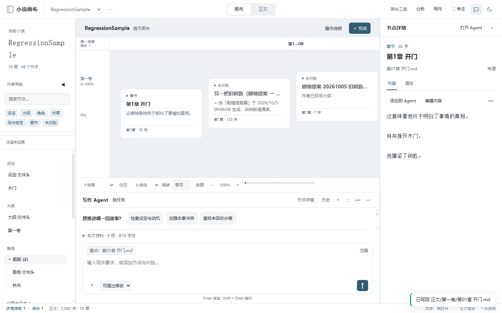
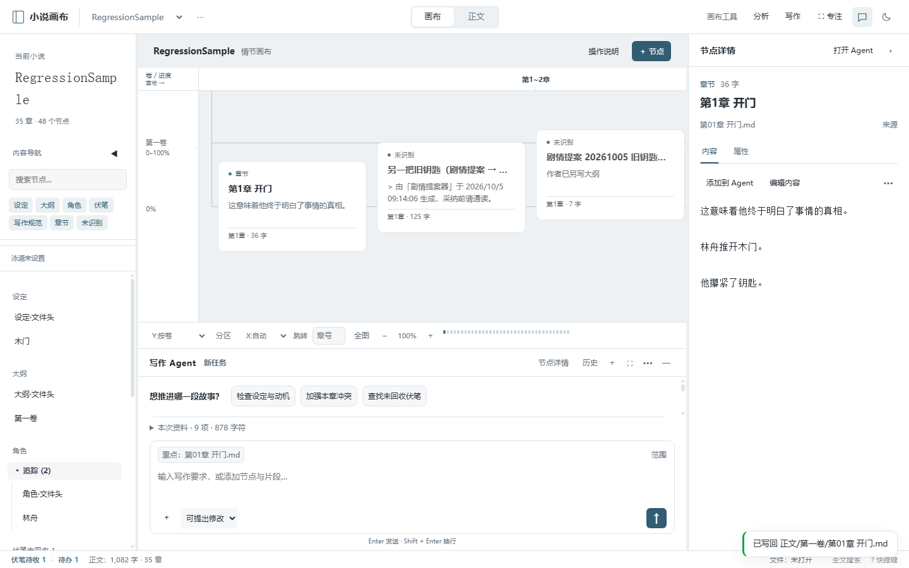
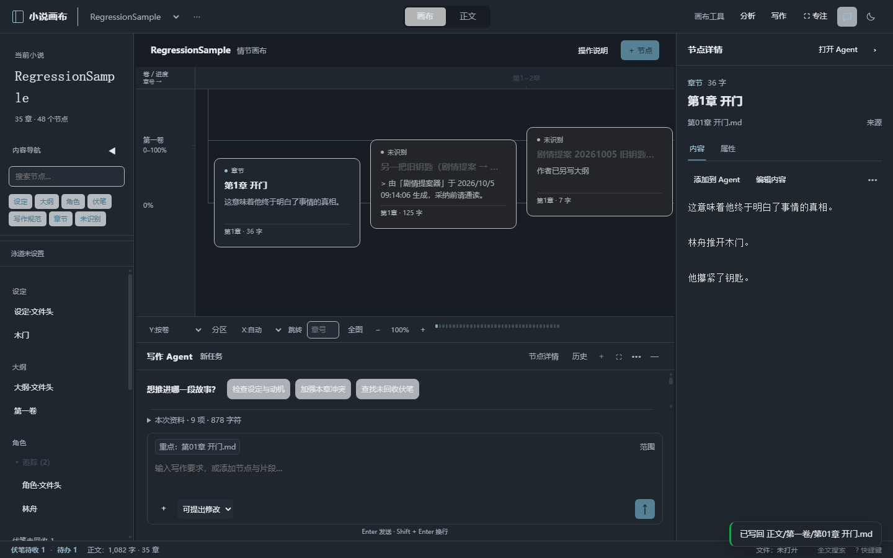

# 右侧栏与 Agent 优化：1.29.0

实施日期：2026-10-05。

## 已实现

- 右栏默认展示节点内容，内容/属性使用独立页签；来源展开查看，复制 ID 和 AI 味检测进入更多菜单。
- 标题显示类型和字数，预览中移除与顶部相同的首个标题；保存内容与保存属性分别操作。
- 中下区域默认展示唯一 Agent 工作区，保留已有停靠偏好。移动到右侧会移走底部同一面板，不新增聊天入口。
- Agent 顶部单行显示任务信息；引用与范围集中到输入区，空白态使用紧凑示例；修改清单改为文件行，保留查看差异、继续调整、拒绝。
- 内容与属性草稿按项目、节点保留在当前窗口；切换页签、节点和刷新恢复草稿。保存期间继续输入保持未保存，保存完成不会抢走新选中的节点。引用读取当前节点草稿。
- 右栏允许 300–480px 拖动，窄窗口采用详情抽屉；底部 Agent 可折叠、拉伸、展开；内容/属性页签支持键盘切换。

## 验证

- `node scripts/upgrade-regression-test.js --smoke`：69 项隔离回归和 142 项冒烟全部通过。
- 最终视觉收敛与折叠高度调整后，`node scripts/upgrade-regression-test.js`：69 项再次通过。
- 回归覆盖默认底部与右侧停靠、唯一面板、内容优先、节点草稿恢复、引用草稿、保存期间输入、窄窗口抽屉，以及既有任务执行、提案、差异审阅流程。
- 检查 1440×900 的浅色/深色运行截图和 900×700 的布局；测试使用临时合成小说、模拟 AI 和隔离浏览器，不读取真实 AI 配置，不修改真实小说正文。
- `node --check` 与 `git diff --check` 通过。

## 运行截图

截图使用合成小说，仅展示真实运行版布局。

## 交付与边界

源码已更新，原便携目录已同步。完整便携可执行文件通过 Electron Builder 生成到 `release/sidebar-upgrade/` 独立目录。

浏览器运行已验证；打包后的桌面可执行文件启动尚未验证。节点草稿仅在当前窗口保留，关闭应用后的持久化恢复不属于本次实现。

## 1.29.1 网格清晰度修复

恢复按真实章节边界排列的纵线，进度横线取消低透明度，分区线使用更强的主题中性色。格线随平移与缩放保持约 1px 的屏幕宽度，避免縮小时变得过淡；纵线仍对齐不同宽度的实际章列。

70 项隔离回归与 142 项冒烟全部通过，检查覆盖浅色、深色及 40% / 100% / 150% 缩放。新版便携程序构建到 `release/grid-upgrade/`；打包后桌面启动尚未验证。

