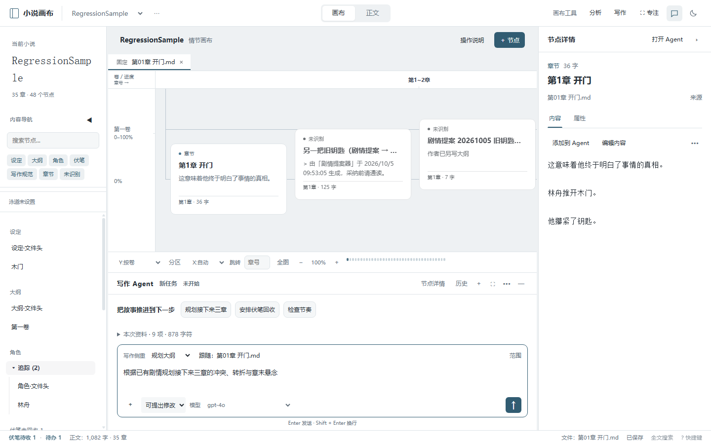
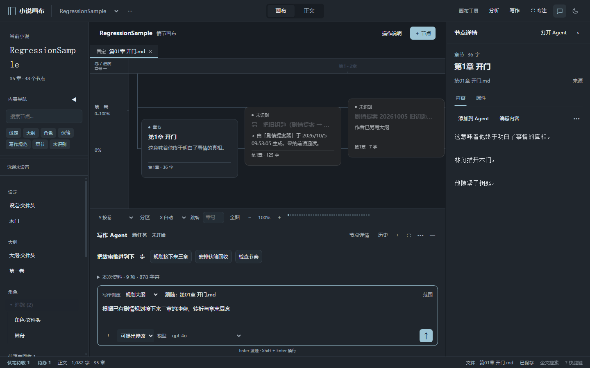

# DeepWrite 参考与画布优化 · v1.30.0

检查日期：2026-10-05。参考仓库：[swjybky/deepwrite](https://github.com/swjybky/deepwrite)。

读取的是最新仓库 v1.6.3，提交 `8c49bf2136e767c59c83a3ad1e1fa6a6286dbb5c`（2026-10-04）。本机旧 `deepwrite` 仓库没有修改；参考源码单独克隆到临时目录，只读分析，没有运行或安装依赖。

## 参考依据与适配

| DeepWrite 的做法 | 画布实际改动 |
| --- | --- |
| 按人物、剧情、大纲、正文等阶段组织 Agent | 将既有六种写作侧重放到输入区；每种侧重有三个相关建议和对应输入提示，不创建第二个助手 |
| 输入区呈现模型、作品和阶段上下文 | 模型直接可选；当前任务文件标签可打开正文，保留未发送输入 |
| 上下文可由用户导航和选择 | 明确区分跟随当前文件/节点、固定重点文件和仅项目资料；修复选中其他节点改变固定范围，发送不会偷偷改变范围模式 |
| 可恢复最近对话与未保存文稿 | 沿用原有独立任务存储，补充关闭/刷新时立即保存；节点内容与属性新增本地草稿恢复 |
| 历史可导航；内容修改需审阅 | 历史显示侧重、目标和待审数量，可搜索对话内容；保留现有提案、Diff 审阅和接受后写盘流程 |

可核查源码：

- [上下文导航栏](https://github.com/swjybky/deepwrite/blob/8c49bf2136e767c59c83a3ad1e1fa6a6286dbb5c/apps/desktop/src/renderer/src/components/ComposerContextBar.vue)
- [对话输入区](https://github.com/swjybky/deepwrite/blob/8c49bf2136e767c59c83a3ad1e1fa6a6286dbb5c/apps/desktop/src/renderer/src/components/ConversationComposer.vue)
- [历史对话菜单](https://github.com/swjybky/deepwrite/blob/8c49bf2136e767c59c83a3ad1e1fa6a6286dbb5c/apps/desktop/src/renderer/src/components/ConversationHistoryMenu.vue)
- [本地草稿恢复](https://github.com/swjybky/deepwrite/blob/8c49bf2136e767c59c83a3ad1e1fa6a6286dbb5c/apps/desktop/src/renderer/src/composables/useLongEditorRecovery.ts)

布局保留画布自身的组织：左侧导航、中央情节画布/正文、右侧节点内容、底部唯一 Agent。没有照搬 DeepWrite 的三栏布局，也没有引入 Vue、额外 Agent 或依赖。沿用主题颜色、字体和强调色，以输入区的侧重与文件标签作为主要操作位置。

## 草稿行为

- 未保存内容、属性、编辑模式与当前页签按项目和节点存入本地浏览器存储，输入后 250ms 写入；正常关闭或刷新时立即补写。
- 再次打开同一节点时恢复，显示未保存状态；草稿不会自动写入小说文件。
- 保存基准与当前加载的正文或属性不同，会显示核对提示。点击保存时再次确认，取消后保留草稿。
- 保存成功只清理已提交部分，保存期间的新输入继续保留。更多菜单可放弃草稿并恢复已保存版本。
- 恢复功能适用于右侧节点编辑；中央文件编辑器仍使用原有三秒自动保存。恢复不是正文备份，清除应用的本地存储会清除恢复记录；在相同应用存储中重新打开节点才能恢复。
- 变化检查比较恢复记录和当前加载版本，不替代服务端的提案冲突校验。

## 验证与产物

`node scripts/upgrade-regression-test.js --smoke`：75 项隔离回归、142 项完整冒烟全部通过。使用临时应用副本、合成小说和本地模拟 AI，不修改真实小说或调用真实模型。

新增验证覆盖：

- 实际刷新恢复节点内容、属性和页签，以及未发送 Agent 输入。
- 恢复时原文有变化，取消覆盖保留草稿；放弃草稿恢复最新已保存版本。
- 六种侧重对应建议，点击不自动发送。
- 范围跟随、固定、仅项目；选中别的节点不改变重点。
- 从上下文标签打开文件，未发送要求仍保留。
- 历史正文搜索、侧重与文件信息、当前任务标识。
- 发送后仍保持跟随模式。

语法检查、差异空白检查通过；浅深主题截图检查通过。网格对比度、缩放、节点拖动、保存竞态与提案审阅等既有回归仍通过。

完整便携程序使用 electron-builder 构建到 `release/deepwrite-upgrade/小说画布-1.30.0-win-x64-portable.exe`。旧便携目录已经同步。浏览器运行已验证，完整 exe 的桌面启动尚未验证。

