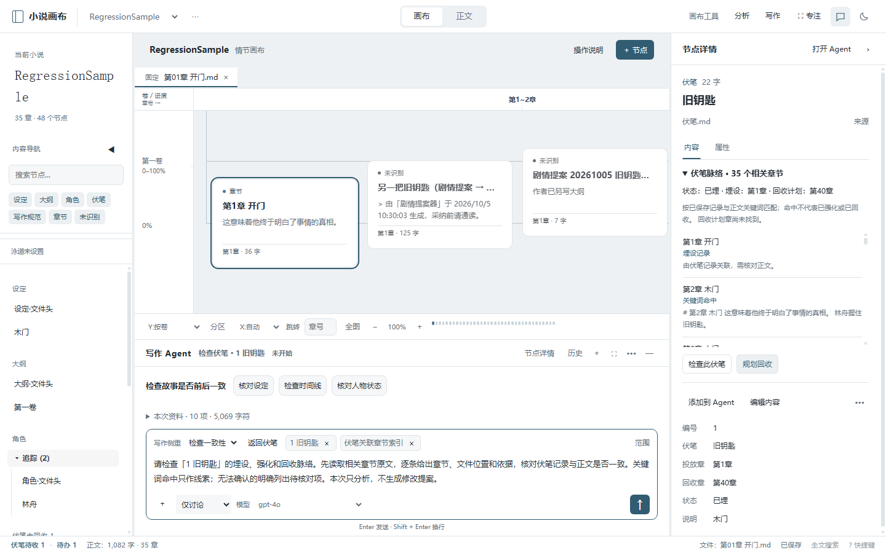
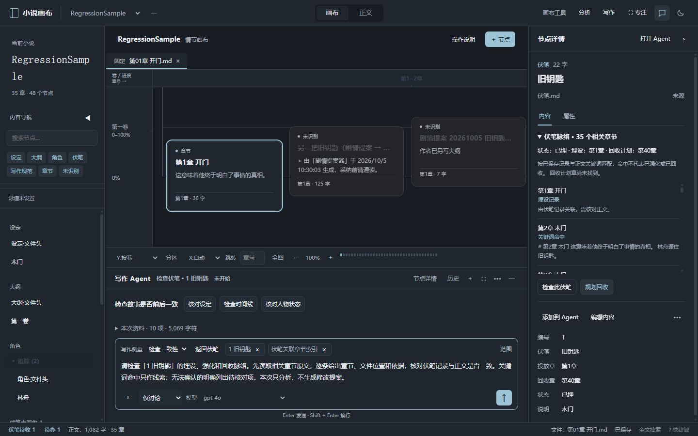

# 伏笔脉络与 Agent 改稿流程 · v1.31.0

本轮把伏笔结构与既有 Agent、提案审阅连接起来，沿用原生 JS/CSS 和受控文件 API，无新增依赖，无第二个助手。

## 使用方式

1. 从左侧导航或画布选中一条伏笔。
2. 右侧“伏笔脉络”展示状态、已保存的埋设/回收记录、相关章节及命中片段。相关章节在画布高亮，点击列表可定位；切换到其他节点清除高亮。
3. 点击“检查此伏笔”，新建仅讨论任务；或点击“规划回收”，新建可提出修改的任务。自动带入当前条目和章节索引，保留原任务未发送的要求。
4. 检查资料与任务要求后发送。Agent 可通过已有工具查阅原文，分析阶段与缺口；修改必须进入既有提案清单。
5. 查看差异并接受提案后，正文/追踪记录通过既有受控 API 写回。节点状态与脉络刷新；任务中的“返回伏笔”可回到原节点。记录被删除时清理旧面板与高亮。

## 证据与边界

- 埋设/回收记录来自表头对应的单元格，不固定列号；保留空单元格，支持中文、“第N章”、“ChN”及纯数字章号。空埋设列不再把回收计划当埋设章。
- 伏笔名称与表格编号分开，名称用于关键词匹配；同时修复原关系矩阵被编号干扰的情况。
- 章节关联包含记录指向的章节和正文中标题/别名的字面命中，展示文件与命中行号。命中只是查证线索，不能据此判定已强化或实际已回收。
- 章节片段优先取当前窗口的未保存文件/节点草稿；选中伏笔的当前内容草稿可作为引用，不自动保存。
- 单条章节索引最多约 8000 字符，超出时明确列出省略数量，要求 Agent 使用搜索/读取工具补查。不会假称完整读完全部正文。
- 没有字面命中时提示检索别称及间接铺垫。未找到计划对应的章节也明确提示。复杂范围、别称和剧情阶段仍需作者/Agent 结合原文确认。
- 伏笔表格以字段名和值预览，编辑仍使用原 Markdown 行。

## 验证

84 项隔离修复回归、142 项完整冒烟全部通过。测试使用临时应用副本、合成小说与模拟 AI，不调用真实模型、不改真实小说。

新增覆盖：

- 六列表格、五列表格调整列序、空埋设格、中文/Ch章号及健康统计口径。
- 记录与命中区分、未写计划章提示、点击定位。
- 画布高亮、重新渲染保留高亮、切换节点清除高亮。
- 草稿内容优先及命中行号。
- 新建只读任务、原任务草稿保留、节点与章节证据引用、返回原伏笔。
- 窄窗口不越界、浅深主题截图、唯一 Agent。
- 实际 Agent 工具调用产生待审提案，接受前文件不变；接受后状态、追踪记录与面板更新。
- 删除伏笔记录后不显示旧脉络或旧高亮。

语法检查与差异空白检查通过。既有的网格、缩放、拖动、任务范围、草稿恢复、保存竞态和提案审阅回归仍通过。

## 产物

完整便携程序：`release/foreshadow-upgrade/小说画布-1.31.0-win-x64-portable.exe`。

旧便携目录已同步。完整程序已构建并检查应用文件匹配；浏览器运行通过，exe 的桌面启动尚未验证。

