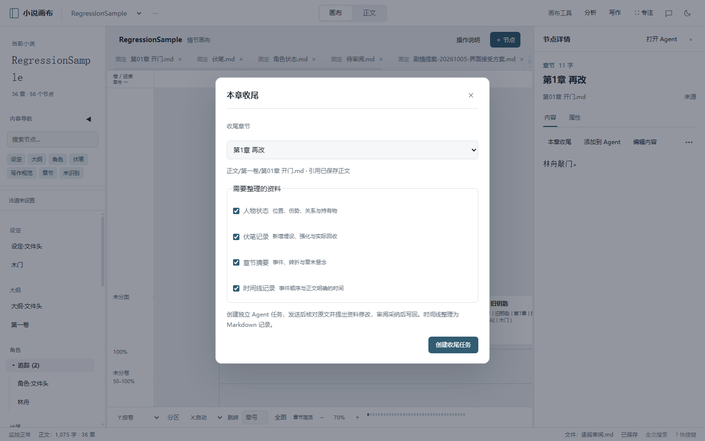
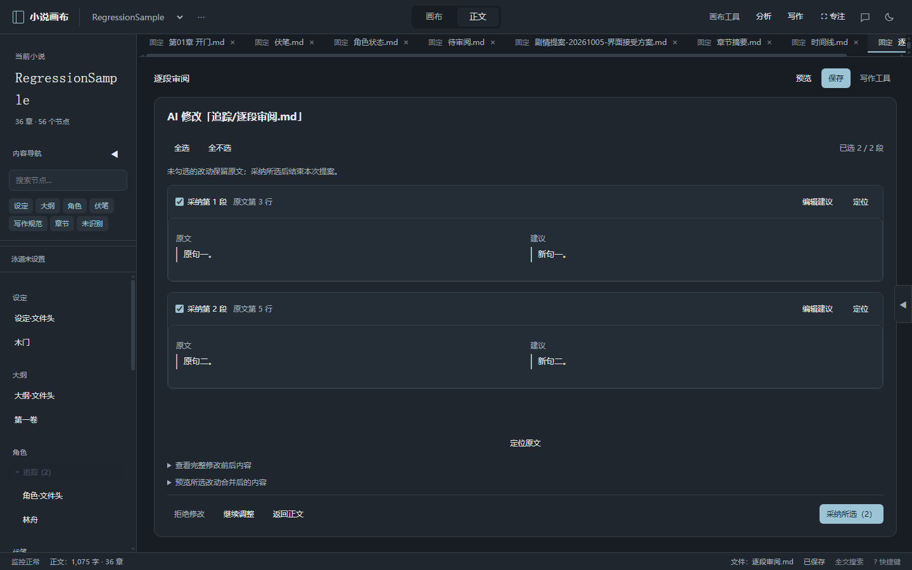
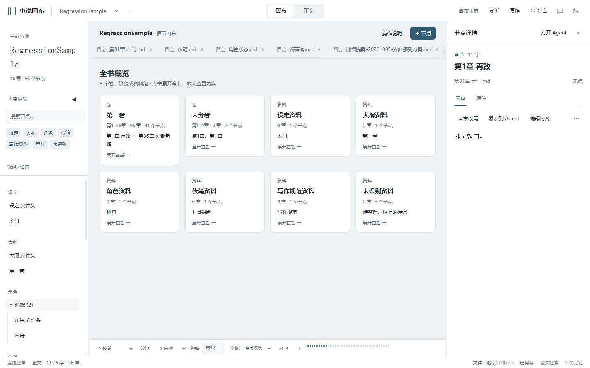

# 本章收尾、逐段采纳与画布分层 · v1.33.0

本轮把写完一章后的资料维护、AI 改稿审阅和全书浏览连起来，保持原生 JS 与现有提案机制，无新增依赖。

## 本章收尾

从正文工具栏、章节详情或“写作 → 本章收尾”进入。选择章节后勾选人物状态、伏笔记录、章节摘要、时间线记录，点击“创建收尾任务”，再在 Agent 中发送要求。

任务固定目标章节，携带当前正文或未保存草稿、前两章索引与项目资料索引，保留原任务要求和引用。资料索引过长时明确标记截断，要求工具补查。Agent 先核对原文和资料全文，按文件合并提案，作者审阅后写回。返回章节按钮可回到原章节。

人物卡已有更晚状态时，要求补本章历史而不覆盖当前状态；伏笔的关键词提及不作为回收证据。摘要优先写入项目已有文件，没有时建议新建 `追踪/章节摘要.md`；时间线同理建议 `追踪/时间线.md`。时间未知时保留未知，不补造日期。

本次时间线为 Markdown 记录。画布 `timelineNodes` 的重要节点仍由时间线编辑器维护，不自动从收尾结果生成标记。任务入口不自动调用模型；事实核对质量仍取决于模型查阅的证据，需要作者审阅。

## 逐段采纳

`edit` 与 `file_edit` 审阅拆分为独立的行变更区间。每段可以勾选、定位原文、编辑建议；可全选/全不选，并预览合并结果。采纳所选后结束本次提案，未选部分保留原文。删除或新建节点仍整份审阅，新建文件则可编辑其插入段。

浏览器与服务端共用 `review_diff.js`。请求只提交区间编号与可选替换文本，服务端重新计算区间，拒绝空选择、重复、越界与跨项目请求，写回前仍核对磁盘原文并备份。未选内容及其换行原样保留；手动编辑段沿用建议段原有 CRLF/LF。改动规模超过计算预算时，明确合并为一个区间，允许编辑或完整对比。

勾选与编辑按项目/提案在当前窗口保留，返回正文或切换文件后可恢复；刷新后恢复原始待审提案，需要重新勾选。采纳等待期间继续编辑正文的缓冲区不会被读盘覆盖，打开另一份审阅也不会被旧请求清空。修改后的剧情方案只有全文与原提案一致时才自动登记原桥段元数据，避免把未采纳内容记为已采用。

## 画布分层

- 小于 35%：卷、阶段、剧情线或章段概览，另列未分章的资料组。显示真实章节范围、节点数量、首末章标题及手动标记的重要事件，点击回到可读比例。
- 35%–85%：标题与已声明的章节核心。未写核心时明确显示缺少核心，其他资料显示摘要，文字不随画布缩到不可读。
- 85% 起：保留类别、标题、正文摘要和字数等完整卡片。

分层不修改节点坐标、连线、泳道归属或剧情推进。概览跟随现有分类与隐藏泳道，搜索定位仍恢复可读比例。2%–35% 的全书比例可正常保存和恢复。全书概览是组卡片列表，轴刻度和节点连线在此层隐藏；放大后恢复原坐标画布。

## 验证

分段算法检查：`npm run test:review`，覆盖 CRLF、末尾换行、插入、删除、重复行、局部采纳、手动替换、无效选择、400 组可复现组合及大差异预算边界。

应用回归：`npm run test:upgrade -- --smoke`，在系统临时目录的应用副本、合成小说与模拟 AI 网关执行，验证收尾任务创建→工具查阅→四份提案→采纳写回、正文不变、分段冲突保护、节点局部写回、缩放分层、筛选与窄窗口。真实小说与真实 AI 配置不参与测试。

最终结果：120 项隔离回归与 142 项冒烟全部通过，分段算法检查通过。浅色、深色与窄窗口检查通过。

完整便携包：`release/chapter-workflow-upgrade/novel-canvas-1.33.0-win-x64-portable.exe`。已有 `release/小说画布-win32-x64/resources/app` 同步源码。额外使用打包后的 Electron 在 Node 模式启动包内 `server.js`，在另一份合成小说上验证前端静态资源、共享差异模块、提案生成和局部采纳，结果通过；桌面窗口启动尚未验证。

